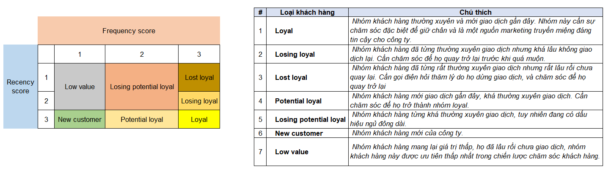

# E-commerce Customer Segmentation (RF Model)

**Business question:** Which customers of a UK online gift retailer should the CRM team protect, re-activate or de-prioritise, and when are customers most active?

Python analysis of 500K+ transaction lines (Dec 2010 – Nov 2011), covering data cleaning, EDA on growth and customer behaviour, and a Recency–Frequency (RF) segmentation that turns 4,293 customers into 7 actionable groups.

## Key insights

| # | Insight | So what? |
|---|---|---|
| 1 | Monthly revenue roughly **doubled** from £0.59M (Dec 2010) to £1.19M (Nov 2011), and orders rose **+81%** (1,708 → 3,086). The steepest climb came in Sep–Nov. | Seasonal (pre-Christmas) demand is the main growth driver, so stock and campaigns should be planned for Q4. |
| 2 | Only **12% of customers are Loyal** (524), while **42% are "Losing" a relationship** (Losing loyal + Losing potential loyal = 1,810). | The biggest opportunity is re-activation, not acquisition. |
| 3 | Customer activity peaks on **Thursday** and between **12:00–14:00**. There are no Saturday transactions. | Send emails and push promotions just before the midday peak on weekdays. |
| 4 | The UK generates ~82% of revenue, but **Netherlands, Australia and Singapore have the highest AOV** (£2,000–3,300 per order). | These are wholesale-like international accounts that are worth key-account treatment. |

## RF segmentation

| Score | 1 | 2 | 3 |
|---|---|---|---|
| **Recency** (days since last order) | > 48 | 15–48 | < 15 |
| **Frequency** (number of orders) | 1 | 2–5 | > 5 |



| Segment | Customers | Recommended action |
|---|---:|---|
| Loyal | 524 | VIP perks and referral programme |
| Potential loyal | 434 | Bundles and loyalty points to push into Loyal |
| New customer | 115 | Onboarding and second-purchase voucher |
| Losing potential loyal | 1,488 | Win-back email with a time-limited offer |
| Losing loyal | 322 | Personal outreach before they churn |
| Lost loyal | 180 | Call or survey to find the reason they left |
| Low value | 1,230 | Low-cost automated campaigns only |

## Workflow

1. **Cleaning:** removed rows with missing values (incl. customer IDs), fixed dtypes, converted negative quantity/price values, and added `amount = quantity × unit_price` plus time features (month, weekday, hour).
2. **EDA:** monthly active users, orders and revenue by month, activity by weekday and hour, top countries, AOV by country, and new vs. returning customers.
3. **RF model:** calculated Recency and Frequency per customer, scored them 1–3, mapped scores to 7 segments, and visualised the results with a bar chart and an R×F heatmap.

## Project structure

```
ecommerce-transaction-analysis/
├── Cleaning and Visualizing Data.ipynb   # Main analysis (cleaning → EDA → RF)
├── 01_e_commerce_data_eda.ipynb           # Project brief & guiding questions
├── Customer segment map.xlsx              # Segment definitions
└── imgs/                                  # RF illustration & segment map
```

## Tools

Python (pandas, matplotlib, seaborn), Jupyter Notebook, Excel

## Data

[UCI Online Retail dataset](https://archive.ics.uci.edu/dataset/352/online+retail): transactions of a UK-based non-store online retailer selling all-occasion gifts, many of whose customers are wholesalers. Place the file at `data/transaction_data.csv` to re-run the notebook.

## Next steps

- Add Monetary value (full RFM) and compare it with K-means clustering
- Build a Power BI dashboard for the CRM team to track segment movement month by month
